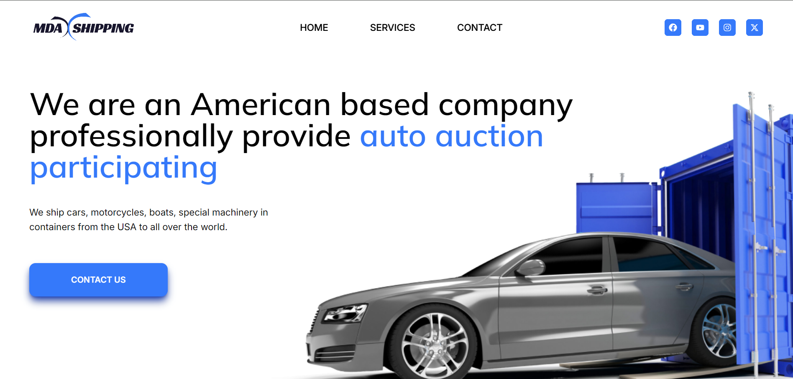
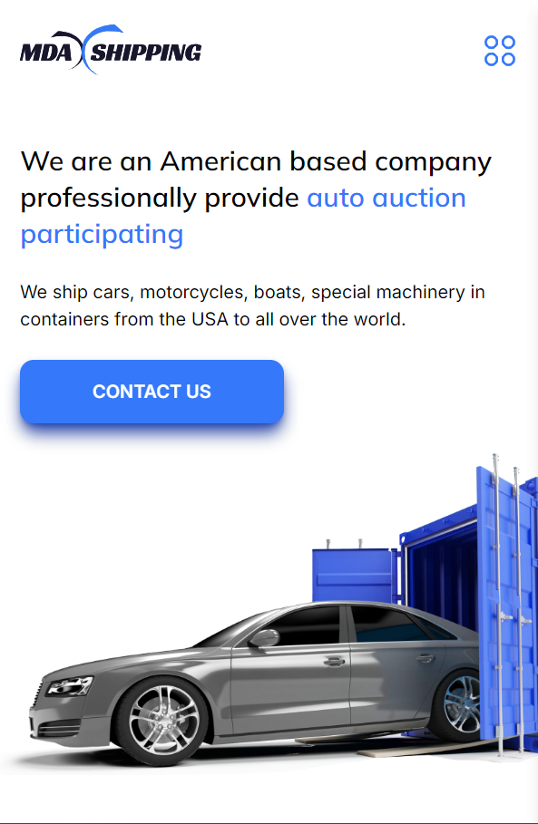

# Car Shipping  React Website

- Car Shipping React Website showing the companys method of operations in their field of shipping cars. It is a user friendly website. 

## Table of contents

- [Screenshot](#screenshot)
- [Links](#links)
- [Built with](#built-with)

## Screenshot

                This is a desktop View.
                 

              This is a mobile view.
                 
  

   
  

  
### Links
<<<<<<< HEAD
- [Demo](https://carshipping.vercel.app)
=======
[Demo-Link]- (https://carshipping.vercel.app)
>>>>>>> 3201e732b25c20dcf1a6110aaea120cc4a906268

### Built with

- Tailwind CSS (https:tailwindcss.com)
- [React](https://reactjs.org/) - JS Frontend Framework
- Framer Motion -  React Animation Library
- React Router
- Vite config -->
